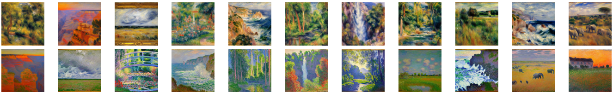

# Illuminating Artistic Intuition: Exploring Zero-Shot Painting Classification and XAI through LIME and Diffusion Models

## Table of Contents
- [Introduction](#introduction)
- [Methodology](#methodology)
- [Models](#models)
- [Data](#data)
- [Results](#results)

## Introduction
This repository contains the code and resources for the project titled "Illuminating Artistic Intuition: Exploring Zero-Shot Painting Classification and XAI through LIME and Diffusion Models." In this project, I explore the classification of painting images using artificially generated data via Stable Diffusion 2.1 prompted with ChatGPT 3.5 motifs and the EfficientNet neural network. While previous studies have achieved high accuracy using real image datasets, this research investigates the use of complete zero-shot approaches, where models are trained solely on artificially generated data. 

My study focuses on classifying paintings by artists Monet and Renoir, employing the EfficientNet model pre-trained on ImageNet and fine-tuned on images generated by the Diffusion models prompted with AI-generated motifs. Additionally, I analyze what is learned from these models in terms of spatial aspects using the LIME (Local Interpretable Model-Agnostic Explanations) algorithm. my results reveal not only the existence of regions that are more important than others in an image for painting classification but also the unique characteristics of each artist in defining these regions.

## Methodology

## Models
The following models are used in this project:

- [Trained on real image datasets](./src/models/model_r.h5)
- [Trained on synthetic image datasets](./src/models/model_s.h5)
- [Trained on real data augmented with synthetic data](./src/models/model_a.h5)

## Results

The first model was trained solely on real images, the second on synthetic images, and the third on real images augmented with synthetic ones. The models' performance was evaluated on two test sub-datasets: real images and synthetic images. The confusion matrices, shown in the figure below, illustrate the results obtained.

The accuracies of the three models in different scenarios were analyzed. In the "Real images vs Real images" scenario, the model trained on real images achieved a test accuracy of 96.67%, which was the best result tied with the model trained on the augmented dataset. In the "Real images vs Synthetic images" scenario, the model performed significantly worse, with an accuracy of 75.0%. This indicates that the images generated by Stable Diffusion do not accurately represent the styles of the artists. The "Synthetic images vs Real images" scenario had the worst performance, with an accuracy of only about 66.29%. However, in the "Synthetic images vs Synthetic images" scenario, the model achieved an accuracy of 98.88%, indicating that Stable Diffusion consistently produces images resembling the styles of Monet and Renoir. The "Real images augmented with Synthetic images vs Real images" scenario provided the same accuracy as the "Real images vs Real images" scenario, while the "Real images augmented with Synthetic images vs Synthetic images" scenario yielded the highest accuracy of 100.0%.

LIME heat maps were generated to identify the most important regions in the images for classifying the paintings. For models trained on real images, the heat maps revealed specific hotspots for Monet and Renoir paintings. Monet's paintings had a horizontal line in the top center, while Renoir's paintings had a centralized hot-spot. Models trained on synthetic images showed hotspots mainly in the bottom right, potentially due to Stable Diffusion emphasizing the locations where Monet and Renoir often sign their paintings. Models trained on augmented images produced heat maps similar to those trained on real images, indicating that the hotspots from the "Real images vs Real images" and "Real images vs Synthetic images" scenarios prevailed.

## Data
The project utilizes the following datasets:

- [Renoir Synthetic Dataset](https://www.kaggle.com/datasets/leonardo1206/renoir-synthetic)
- [Monet Synthetic Dataset](https://www.kaggle.com/datasets/leonardo1206/monet-synthetic)
- [Wikiart Monet & Renoir Dataset](https://www.kaggle.com/datasets/leonardo1206/wikiart-monet-renoir)